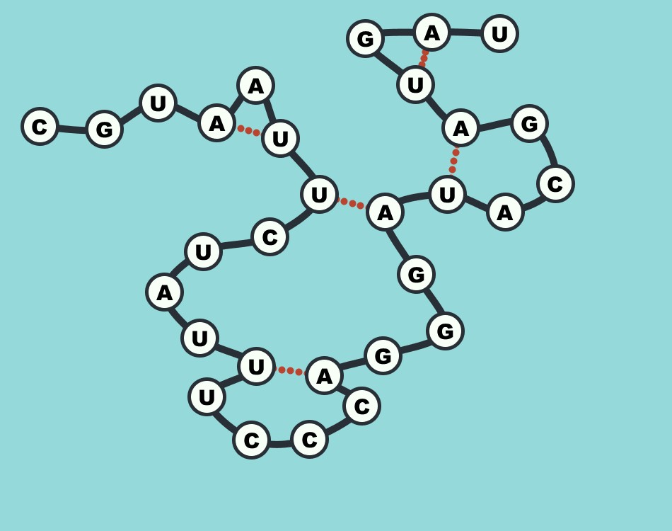
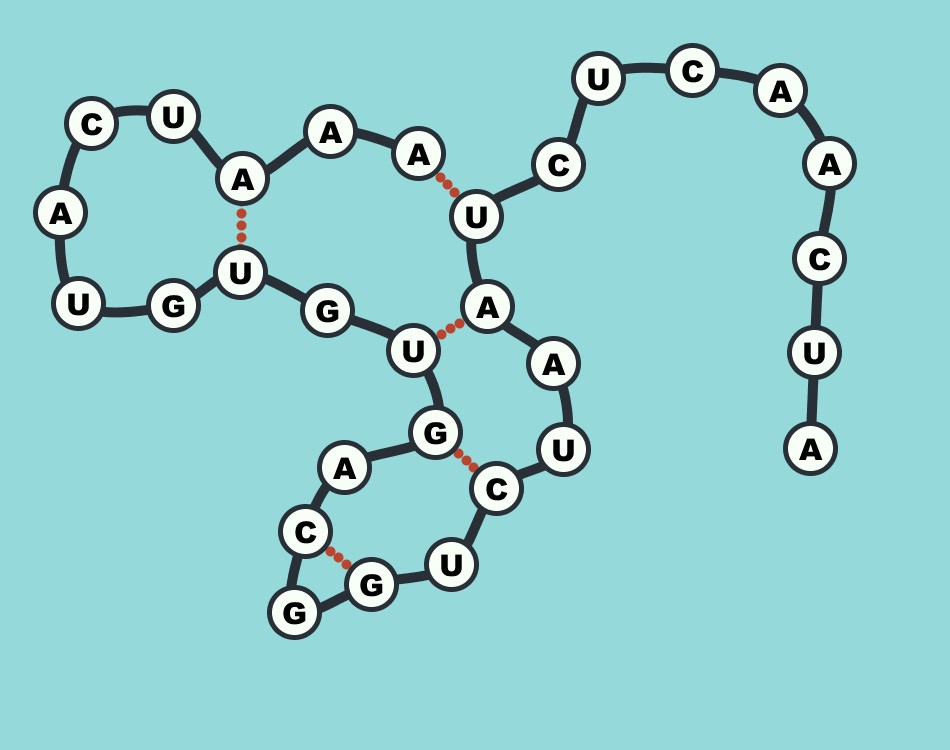

Since a certain RNA related topic has gone viral in last couple of months, I propose we have a quick look at a biochemistry puzzle about this strange molecule. Who doesn’t like some recreational maths during quarantine anyways?
### What is RNA and what can we use it for?
At a chemical level, RNA is a continuous chain of 4 alternating blocks: adenine (A), uracil (U), guanine (G) and cytosine (C). They are conventionally called nucleotides or bases. Despite what you may think, RNA is not limited to encoding the genetic information of nasty bugs, in fact it can carry numerous tasks inside the cell by folding into complex three-dimensional structures. For example, protein synthesis is directed by different types of RNA! The folding occurs mainly due the formation of hydrogen bonds between the nucleotides – or, simply put, adenine and uracil like to pair up with one another whereas cytosine is complementary to guanine. This results in the RNA bending over and attaching to itself at different points, creating loops and double-stranded regions.

Researchers are trying to employ the geometry of these versatile molecules and develop short RNAs which can bind to particular targets inside the body. These so-called aptamers could be used to specifically deliver drugs only to affected tissues and thus decrease the adverse effects of treatments such as chemotherapy.

Solarized dark             |  Solarized Ocean
:-------------------------:|:-------------------------:
  |  

